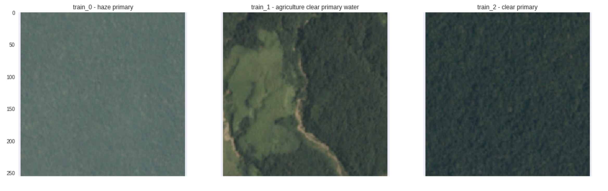

## A PyTorch repo for Planet: Understanding the Amazon from Space Kaggle Competition.

This repository's main objective is to serve as a starting point to [PyTorch](http://pytorch.org/). The parts that are covered are:
- A simple data loader that inherits `torch.utils.data.Dataset`. Adds default transformations from `torchvision.transforms`.
- Definition of a simple convolutional network and all necessary building blocks for training/validation.
- Loading pretrained models e.g. ResNet
- Visualizing training in tensorboard.
- Predicting on new images.

### Requirements
- PyTorch. For installation refer to http://pytorch.org/.
- TensorFlow is required for visualization. CPU version is enough. For installation https://www.tensorflow.org/.
- Tensorboard logger. To install `pip install tensorboard_logger`. For usage [click here](https://github.com/TeamHG-Memex/tensorboard_logger).
- Only Python 3+ is supported.

### Data
The data we are using are taken from [Planet: Understanding the Amazon from Space](https://www.kaggle.com/c/planet-understanding-the-amazon-from-space) Kaggle competition. More info can be found at the competition website. In a nutshell we want to label satellite image chips with atmospheric conditions and various classes of land cover/land use. It is a multi-labeling problem with 17 different classes. In the competition algorithms were scored using the mean F2 score.



Here we only use the jpg images. Note that the `test-jpg/` and `test-additional-jpg/` need to be merged for prediction. The data can still be downloaded [here](https://www.kaggle.com/c/planet-understanding-the-amazon-from-space/data). The `csv` files don't need to be downloaded as we provide our own for train and validation set.

### Training

```
python train.py

        --model         # specify model, (PlanetSimpleNet, PlanetResNet18)
        --patience      # early stopping
        --batch_size    # batch size
        --nepochs       # max epochs
        --nocuda        # no cuda
        -v              # verbose, extra info during training
        --nworkers      # number of workers
        --seed          # random seed
```
Models are saved in `saved-models/` using the model name and the training run. Note that input images should be at least 224x224 as it is a requirement for pretrained models. Pretrained models are finetuned with a small learning rate.

### Logging
Logs are saved in the `logs` folder. Each model in its own folder with a folder for each run. 
`tensorboard --logdir yourlogdir` will start tensorboard. For remote working add the following to `.ssh/config` for tunneling:
```
Host name
        HostName hostaddress
        User username
        IdentityFile path_to_id_rsa
        LocalForward 8888 127.0.0.1:6006
```
Tensorboard can be viewed at `127.0.0.1:8888` in your browser.

### Predicting
```
python predict.py <saved_model>

        --batch_size    # batch size
        --nocuda        # no cuda
        --nworkers      # number of workers
        --output_file   # naming for output csv
```

Default saved model to load is PlanetSimpleNet. This should give you around 0.87 in the public leaderboard. PlanetResNet18 should give around 0.92.

#### Progress
- [x] Dataloader with transformations.
- [x] Simple convolutional network.
- [x] Pretrained models.
- [x] Tensorboard integration.
- [x] Predict labels on test images.
